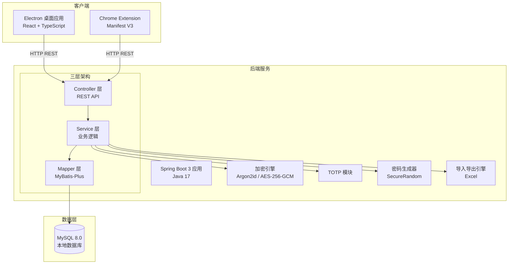
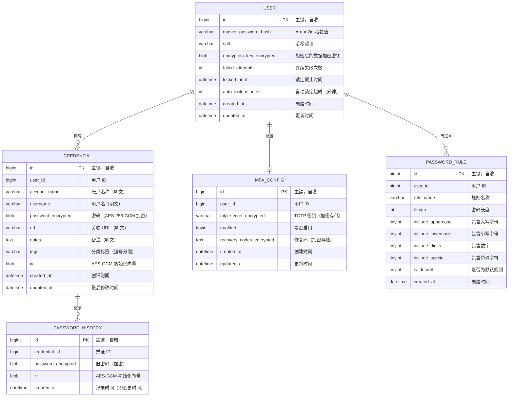
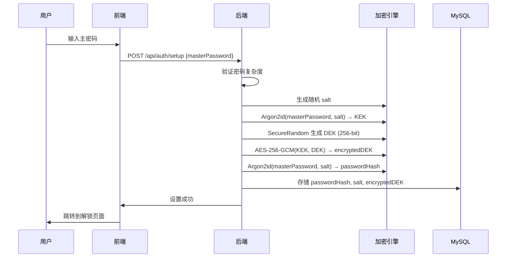
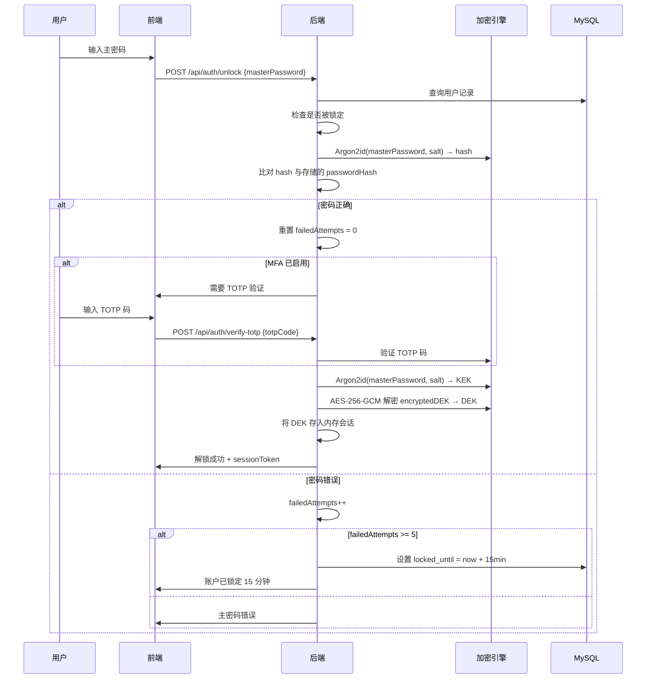
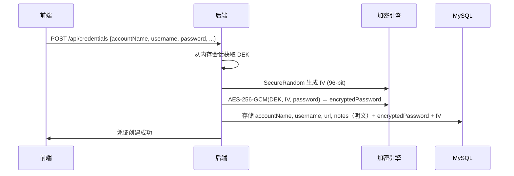

# 密码管理器 — 技术设计文档

## 概述

本文档描述密码管理器（Password Manager）的技术设计方案，采用前后端分离架构。后端基于 Java 17 + Spring Boot 3 + MySQL 8.0 + MyBatis-Plus 构建，承担所有核心业务逻辑和数据存储；前端包括 Electron 桌面应用（React + TypeScript）和 Chrome Extension（Manifest V3），仅负责 UI 展示和用户交互。

系统核心能力：
- 主密码认证与 MFA（TOTP）支持
- 密码学安全的密码生成（CSPRNG）
- AES-256-GCM 加密的凭证存储
- 凭证的 CRUD、搜索、分类
- 密码安全性评估与安全报告
- 数据导入/导出（支持加密 Excel 格式）
- 密码历史查询（查看凭证的密码变更记录）
- 自动锁定与会话管理

## 架构

### 系统架构图



### 通信方式

- Electron 应用和 Chrome Extension 均通过 HTTP REST API 与后端通信
- API 统一返回 JSON 格式，使用统一响应包装 `ApiResponse<T>`
- Chrome Extension 通过 `chrome.runtime` 消息机制与 background service worker 通信，由 service worker 发起 HTTP 请求

### 技术栈选型

| 层级　　　 | 技术　　　　　　　　　　　　| 版本　　　　| 说明　　　　　　　　　 |
| ------------| -----------------------------| -------------| ------------------------|
| 后端语言　 | Java　　　　　　　　　　　　| 17　　　　　| LTS 版本　　　　　　　 |
| 后端框架　 | Spring Boot　　　　　　　　 | 3.x　　　　 | 主框架　　　　　　　　 |
| ORM　　　　| MyBatis-Plus　　　　　　　　| 3.5.x　　　 | 数据访问　　　　　　　 |
| 数据库　　 | MySQL　　　　　　　　　　　 | 8.0　　　　 | 本地存储　　　　　　　 |
| 数据库迁移 | Flyway　　　　　　　　　　　| 9.x　　　　 | Schema 版本管理　　　　|
| API 文档　 | SpringDoc OpenAPI　　　　　 | 2.x　　　　 | 自动生成 API 文档　　　|
| 工具库　　 | Lombok + MapStruct　　　　　| -　　　　　 | 减少样板代码　　　　　 |
| 密码哈希　 | Bouncy Castle (Argon2id)　　| 1.7x　　　　| 主密码哈希　　　　　　 |
| 对称加密　 | JCE (AES-256-GCM)　　　　　 | -　　　　　 | 凭证数据加密　　　　　 |
| TOTP　　　 | java-totp　　　　　　　　　 | 1.x　　　　 | 多因素认证　　　　　　 |
| 随机数　　 | java.security.SecureRandom　| -　　　　　 | CSPRNG　　　　　　　　 |
| 构建工具　 | Gradle　　　　　　　　　　　| 8.x　　　　 | 项目构建　　　　　　　 |
| Excel 处理 | EasyExcel　　　　　　　　　 | 3.x　　　　 | Excel 导入导出及加密　 |
| 前端框架　 | React + TypeScript　　　　　| 18.x / 5.x　| Electron 渲染层　　　　|
| 桌面壳　　 | Electron　　　　　　　　　　| 28.x　　　　| 桌面应用　　　　　　　 |
| 浏览器插件 | Chrome Extension　　　　　　| Manifest V3 | 浏览器集成　　　　　　 |
| 属性测试　 | jqwik　　　　　　　　　　　 | 1.8.x　　　 | Property-Based Testing |
| 单元测试　 | JUnit 5 + Mockito + AssertJ | -　　　　　 | 单元/集成测试　　　　　|


## 组件与接口

### 后端包结构

```
com.pm.passwordmanager/
├── controller/                   # REST 控制器
│   ├── AuthController.java       # 认证相关 API
│   ├── CredentialController.java # 凭证 CRUD API
│   ├── PasswordGenController.java# 密码生成 API
│   ├── SecurityReportController.java # 安全报告 API
│   ├── ImportExportController.java   # 导入导出 API（Excel）
│   ├── PasswordHistoryController.java # 密码历史查询 API
│   └── SettingsController.java   # 设置 API
├── service/                      # 业务逻辑层
│   ├── AuthService.java
│   ├── CredentialService.java
│   ├── PasswordGeneratorService.java
│   ├── SecurityReportService.java
│   ├── ImportExportService.java
│   ├── PasswordHistoryService.java
│   ├── SessionService.java
│   ├── MfaService.java
│   └── impl/
│       ├── AuthServiceImpl.java
│       ├── CredentialServiceImpl.java
│       ├── PasswordGeneratorServiceImpl.java
│       ├── SecurityReportServiceImpl.java
│       ├── ImportExportServiceImpl.java
│       ├── PasswordHistoryServiceImpl.java
│       ├── SessionServiceImpl.java
│       └── MfaServiceImpl.java
├── mapper/                       # MyBatis-Plus Mapper
│   ├── UserMapper.java
│   ├── CredentialMapper.java
│   ├── PasswordHistoryMapper.java
│   ├── PasswordRuleMapper.java
│   └── MfaConfigMapper.java
├── entity/                       # 数据库实体
│   ├── UserEntity.java
│   ├── CredentialEntity.java
│   ├── PasswordHistoryEntity.java
│   ├── PasswordRuleEntity.java
│   └── MfaConfigEntity.java
├── dto/
│   ├── request/
│   │   ├── CreateMasterPasswordRequest.java
│   │   ├── UnlockVaultRequest.java
│   │   ├── VerifyTotpRequest.java
│   │   ├── EnableMfaRequest.java
│   │   ├── GeneratePasswordRequest.java
│   │   ├── CreateCredentialRequest.java
│   │   ├── UpdateCredentialRequest.java
│   │   ├── SearchCredentialRequest.java
│   │   ├── ImportRequest.java
│   │   ├── ExportRequest.java
│   │   └── UpdateSettingsRequest.java
│   └── response/
│       ├── ApiResponse.java
│       ├── UnlockResultResponse.java
│       ├── MfaSetupResponse.java
│       ├── GeneratedPasswordResponse.java
│       ├── CredentialResponse.java
│       ├── CredentialListResponse.java
│       ├── SecurityReportResponse.java
│       ├── PasswordStrengthResponse.java
│       ├── PasswordHistoryResponse.java
│       └── ExportResultResponse.java
├── config/
│   ├── SecurityConfig.java       # 安全配置
│   ├── CorsConfig.java           # 跨域配置
│   ├── MyBatisPlusConfig.java    # MyBatis-Plus 配置
│   └── EncryptionConfig.java     # 加密参数配置
├── exception/
│   ├── ErrorCode.java            # 错误码枚举
│   ├── BusinessException.java    # 统一业务异常
│   └── GlobalExceptionHandler.java # 全局异常处理器
├── enums/
│   ├── ConflictStrategy.java     # 导入冲突策略枚举
│   └── PasswordStrengthLevel.java # 密码强度等级枚举
└── util/
    ├── EncryptionEngine.java     # AES-256-GCM 加密/解密
    ├── Argon2Hasher.java         # Argon2id 哈希
    ├── PasswordStrengthEvaluator.java # 密码强度评估
    ├── TotpUtil.java             # TOTP 工具
    ├── SecureRandomUtil.java     # CSPRNG 工具
    └── ExcelEncryptionUtil.java  # Excel 加密/解密工具
```

### REST API 设计

#### 认证模块 (`/api/auth`)

| 方法　 | 路径　　　　　　　　　　| 说明　　　　　 | 请求体　　　　　　　　　　　　| 响应　　　　　　　　　　　　　　　　|                                 |
| --------| -------------------------| ----------------| -------------------------------| -------------------------------------| ---------------------------------|
| POST　 | `/api/auth/setup`　　　 | 首次创建主密码 | `CreateMasterPasswordRequest` | `ApiResponse<Void>`　　　　　　　　 |                                 |
| POST　 | `/api/auth/unlock`　　　| 解锁密码库　　 | `UnlockVaultRequest`　　　　　| `ApiResponse<UnlockResultResponse>` |                                 |
| POST　 | `/api/auth/verify-totp` | 验证 TOTP 码　 | `VerifyTotpRequest`　　　　　 | `ApiResponse<UnlockResultResponse>` |                                 |
| POST　 | `/api/auth/lock`　　　　| 手动锁定密码库 | -　　　　　　　　　　　　　　 | `ApiResponse<Void>`　　　　　　　　 |                                 |
| POST　 | `/api/auth/mfa/enable`　| 启用 MFA　　　 | `EnableMfaRequest`　　　　　　| `ApiResponse<MfaSetupRespons　　　　| piResponse<CredentialResponse>` |
| PUT　　| `/api/credentials/{id}` | 更新凭证　　　 | `UpdateCredentialRequest`　　 | `ApiResponse<CredentialResponse>`　 |                                 |
| DELETE | `/api/credentials/{id}` | 删除凭证　　　 | -　　　　　　　　　　　　　　 | `ApiResponse<Void>`　　　　　　　　 |                                 |

#### 密码历史模块 (`/api/credentials/{id}/password-history`)

| 方法 | 路径　　　　　　　　　　　　　　　　　　　　　　　　　　　　| 说明　　　　　　　　　　　　　　　　　　 | 响应　　　　　　　　　　　　　　　　　　　　 |                           |                                         |
| ------| -------------------------------------------------------------| ------------------------------------------| ----------------------------------------------| ---------------------------| -----------------------------------------|
| GET　| `/api/credentials/{id}/password-history`　　　　　　　　　　| 获取凭证的密码变更历史（最近10条，倒序） | `ApiResponse<List<PasswordHistoryResponse>>` |                           |                                         |
| POST | `/api/credentials/{id}/password-history/{historyId}/reveal` | 明d-generator/evaluate`　　　　　　　　　| 评估密码强度　　　　　　　　　　　　　　　　 | `EvaluatePasswordRequest` | `ApiResponse<PasswordStrengthResponse>` |

#### 安全报告模块 (`/api/security-report`)

| 方法 | 路径　　　　　　　　　　　　　　 | 说明　　　　　　　　　　　　　　| 响应　　　　　　　　　　　　　　　　　　　　|                     |
| ------| ----------------------------------| ---------------------------------| ---------------------------------------------| ---------------------|
| GET　| `/api/security-report`　　　　　 | 获取安全报告　　　　　　　　　　| `ApiResponse<SecurityReportResponse>`　　　 |                     |
| GET　| `/api/security-report/weak`　　　| 获取弱密码列表　　　　　　　　　| `ApiResponse<List<CredentialListResponse>>` |                     |
| GET　| `/api/security-report/duplicate` | 获取重复密码列表　　　　　　　　| `ApiResponse<List<CredentialListResponse>>` |                     |
| GET　| `/api/security-report/expired`　 | 获取超sponse<SettingsResponse>` | 　　　　　　　　　　　　　　　　　　　　　　|                     |
| PUT　| `/api/settings`　　　　　　　　　| 更新用户设置　　　　　　　　　　| `UpdateSettingsRequest`　　　　　　　　　　 | `ApiResponse<Void>` |

### 关键接口定义

#### 统一响应包装

```java
@Getter
@Builder
@NoArgsConstructor
@AllArgsConstructor
public class ApiResponse<T> {
    private int code;
    private String message;
    private T data;

    public static <T> ApiResponse<T> success(T data) {
        return ApiResponse.<T>builder().code(0).message("success").data(data).build();
    }

    public static <T> ApiResponse<T> error(ErrorCode errorCode) 响应

```java
@Data
@Builder
public class PasswordHistoryResponse {
    private Long id;
    private String maskedPassword;  // 掩码显示 "••••••"
    private LocalDateTime changedAt;
}
```

#### 加密引擎接口

```java
public interface EncryptionEngine {
    /** AES-256-GCM 加密 */
    EncryptedData encrypt(byte[] plaintext, byte[] key);

    /** AES-256-GCM 解密 */
    byte[] decrypt(EncryptedData encryptedData, byte[] key);

    /** 生成随机 DEK */
    byte[] generateDek();

    /** 生成随机 IV (96-bit) */
    byte[] generateIv();
}

@Data
@AllArgsConstructor
public class EncryptedData {
    private byte[] ciphertext;
    private byte[] iv;
}
```

#### Argon2 哈希接口

```java
public interface Argon2Hasher {
    /** 使用 Argon2id 对密码进行哈希 */
    String hash(String password, byte[] salt);

    /** 验证密码与哈希是否匹配 */
    boolean verify(String password, byte[] salt, String expectedHash);

    /** 从密码派生 KEK */
    byte[] deriveKey(String password, byte[] salt, int keyLengthBytes);

    /** 生成随机盐值 */
    byte[] generateSalt();
}
```

#### 密码强度评估接口

```java
public interface PasswordStrengthEvaluator {
    /**
     * 评估密码强度。
     * 规则：长度 < 8 → 弱；8-15 且 ≥ 2 种字符类型 → 中；≥ 16 且 ≥ 3 种字符类型 → 强
     */
    PasswordStrengthLevel evaluate(String password);
}
```

#### 导入导出服务接口

```java
public interface ImportExportService {
    /** 导出凭证为加密 Excel 文件 */
    byte[] exportAsEncryptedExcel(Long userId, String encryptionPassword);

    /** 导入 Excel 文件 */
    ImportResultResponse importFromExcel(Long userId, byte[] fileContent, String filePassword, ConflictStrategy strategy);
}
```

#### 密码历史服务接口

```java
public interface PasswordHistoryService {
    /** 获取凭证的密码变更历史（最近 10 条，按时间倒序） */
    List<PasswordHistoryResponse> getHistory(Long credentialId);

    /** 获取某条历史密码的明文（解密后返回） */
    String revealHistoryPassword(Long historyId);

    /** 记录密码变更（在密码更新时由 CredentialService 调用） */
    void recordPasswordChange(Long credentialId, byte[] oldPasswordEncrypted, byte[] iv);
}
```


### 前端组件设计

#### Electron 桌面应用

```
electron-app/
├── main/                         # Electron 主进程
│   ├── main.ts                   # 应用入口
│   ├── ipc-handlers.ts           # IPC 消息处理
│   ├── clipboard-manager.ts      # 剪贴板管理（60s 自动清除）
│   └── auto-lock.ts              # 自动锁定检测
├── renderer/                     # React 渲染进程
│   ├── pages/
│   │   ├── SetupPage.tsx         # 首次设置主密码
│   │   ├── UnlockPage.tsx        # 解锁页面（含 TOTP 输入）
│   │   ├── VaultPage.tsx         # 凭证列表主页
│   │   ├── CredentialDetailPage.tsx # 凭证详情/编辑
│   │   ├── PasswordHistoryPage.tsx  # 密码历史查询页面
│   │   ├── PasswordGeneratorPage.tsx # 密码生成器
│   │   ├── SecurityReportPage.tsx   # 安全报告
│   │   ├── ImportExportPage.tsx     # 导入导出（Excel）
│   │   └── SettingsPage.tsx         # 设置页面
│   ├── components/
│   │   ├── PasswordInput.tsx     # 密码输入框（掩码/明文切换）
│   │   ├── StrengthIndicator.tsx # 密码强度指示器
│   │   ├── CredentialCard.tsx    # 凭证卡片
│   │   ├── SearchBar.tsx         # 搜索栏
│   │   ├── TagFilter.tsx         # 标签筛选
│   │   └── ConfirmDialog.tsx     # 确认对话框
│   ├── services/
│   │   └── api-client.ts         # HTTP API 客户端封装
│   └── hooks/
│       ├── useAutoLock.ts        # 自动锁定 Hook
│       └── useClipboard.ts       # 剪贴板 Hook（含 60s 自动清除）
└── preload/
    └── preload.ts                # 预加载脚本（安全桥接）
```

#### Chrome Extension

```
chrome-extension/
├── manifest.json                 # Manifest V3 配置
├── background/
│   └── service-worker.ts         # 后台服务（API 请求代理）
├── popup/
│   ├── Popup.tsx                 # 弹出窗口主界面
│   ├── QuickSearch.tsx           # 快速搜索凭证
│   └── AutoFillPrompt.tsx        # 自动填充提示
├── content/
│   └── content-script.ts         # 内容脚本（检测登录表单）
└── shared/
    └── api-client.ts             # 与后端通信的 API 客户端
```

Chrome Extension 核心流程：
1. Content Script 检测页面登录表单，提取 URL
2. 通过 `chrome.runtime.sendMessage` 通知 Service Worker
3. Service Worker 调用后端 API 查询匹配的凭证
4. 用户确认后，通过 Content Script 自动填充表单

### 关键模块详细设计

#### 导入导出引擎

导出 Excel 流程：
1. 从数据库查询用户所有凭证（加密态）
2. 使用会话中的 DEK 解密凭证数据
3. 使用 EasyExcel 写入 Excel 工作表（列：账户名称、用户名、密码、URL、备注、标签）
4. 使用 Apache POI 的 `EncryptionInfo` 对 Excel 文件设置密码保护
5. 返回加密后的 Excel 字节流

导入 Excel 流程：
1. 要求用户输入 Excel 文件密码
2. 使用 Apache POI 解密 Excel 文件
3. 使用 EasyExcel 读取工作表数据
4. 按冲突策略（覆盖/跳过/保留两者）逐条处理
5. 使用会话 DEK 加密后存入数据库

#### 密码历史查询模块

密码历史查询流程：
1. 前端请求 `GET /api/credentials/{id}/password-history`
2. 后端查询 `pm_password_history` 表，按 `created_at` 倒序，限制 10 条
3. 返回掩码密码列表（不返回明文）
4. 用户点击"显示密码"时，前端请求 `POST /api/credentials/{id}/password-history/{historyId}/reveal`
5. 后端使用会话 DEK 解密历史密码并返回明文
6. 前端 30 秒后自动恢复掩码显示

密码变更记录流程（由 CredentialService 在更新密码时触发）：
1. 更新密码前，将当前加密密码和 IV 写入 `pm_password_history` 表
2. 检查该凭证的历史记录数量，若超过 10 条则删除最早的记录
3. 更新凭证的密码字段和 `updated_at` 时间戳


## 数据模型

### ER 图



### MySQL 表定义

#### `pm_user` 表

```sql
CREATE TABLE pm_user (
    id                      BIGINT AUTO_INCREMENT PRIMARY KEY,
    master_password_hash    VARCHAR(512)  NOT NULL COMMENT 'Argon2id 哈希值',
    salt                    VARCHAR(128)  NOT NULL COMMENT '哈希盐值',
    encryption_key_encrypted BLOB         NOT NULL COMMENT '加密后的 DEK',
    failed_attempts         INT           NOT NULL DEFAULT 0 COMMENT '连续失败次数',
    locked_until            DATETIME      NULL COMMENT '锁定截止时间',
    auto_lock_minutes       INT           NOT NULL DEFAULT 5 COMMENT '自动锁定超时',
    created_at              DATETIME      NOT NULL DEFAULT CURRENT_TIMESTAMP,
    updated_at              DATETIME      NOT NULL DEFAULT CURRENT_TIMESTAMP ON UPDATE CURRENT_TIMESTAMP
) ENGINE=InnoDB DEFAULT CHARSET=utf8mb4 COMMENT='用户表';
```

#### `pm_credential` 表

```sql
CREATE TABLE pm_credential (
    id                BIGINT AUTO_INCREMENT PRIMARY KEY,
    user_id           BIGINT        NOT NULL COMMENT '用户 ID',
    account_name      VARCHAR(256)  NOT NULL COMMENT '账户名称',
    username          VARCHAR(256)  NOT NULL COMMENT '用户名',
    password_encrypted BLOB         NOT NULL COMMENT '密码（AES-256-GCM）',
    url               VARCHAR(1024) NULL COMMENT '关联 URL',
    notes             TEXT          NULL COMMENT '备注',
    tags              VARCHAR(512)  NULL COMMENT '分类标签',
    iv                BLOB          NOT NULL COMMENT 'AES-GCM IV',
    created_at        DATETIME      NOT NULL DEFAULT CURRENT_TIMESTAMP,
    updated_at        DATETIME      NOT NULL DEFAULT CURRENT_TIMESTAMP ON UPDATE CURRENT_TIMESTAMP,
    INDEX idx_pm_credential_user_id (user_id),
    INDEX idx_pm_credential_tags (tags)
) ENGINE=InnoDB DEFAULT CHARSET=utf8mb4 COMMENT='凭证表';
```

#### `pm_password_history` 表

```sql
CREATE TABLE pm_password_history (
    id                 BIGINT AUTO_INCREMENT PRIMARY KEY,
    credential_id      BIGINT   NOT NULL COMMENT '凭证 ID',
    password_encrypted BLOB     NOT NULL COMMENT '旧密码（加密）',
    iv                 BLOB     NOT NULL COMMENT 'AES-GCM IV',
    created_at         DATETIME NOT NULL DEFAULT CURRENT_TIMESTAMP COMMENT '变更时间',
    INDEX idx_pm_password_history_credential_id (credential_id)
) ENGINE=InnoDB DEFAULT CHARSET=utf8mb4 COMMENT='密码历史表';
```

#### `pm_password_rule` 表

```sql
CREATE TABLE pm_password_rule (
    id                BIGINT AUTO_INCREMENT PRIMARY KEY,
    user_id           BIGINT       NOT NULL COMMENT '用户 ID',
    rule_name         VARCHAR(128) NOT NULL COMMENT '规则名称',
    length            INT          NOT NULL DEFAULT 16 COMMENT '密码长度',
    include_uppercase TINYINT      NOT NULL DEFAULT 1 COMMENT '包含大写字母',
    include_lowercase TINYINT      NOT NULL DEFAULT 1 COMMENT '包含小写字母',
    include_digits    TINYINT      NOT NULL DEFAULT 1 COMMENT '包含数字',
    include_special   TINYINT      NOT NULL DEFAULT 1 COMMENT '包含特殊字符',
    is_default        TINYINT      NOT NULL DEFAULT 0 COMMENT '是否默认规则',
    created_at        DATETIME     NOT NULL DEFAULT CURRENT_TIMESTAMP,
    updated_at        DATETIME     NOT NULL DEFAULT CURRENT_TIMESTAMP ON UPDATE CURRENT_TIMESTAMP,
    INDEX idx_pm_password_rule_user_id (user_id)
) ENGINE=InnoDB DEFAULT CHARSET=utf8mb4 COMMENT='密码规则表';
```

#### `pm_mfa_config` 表

```sql
CREATE TABLE pm_mfa_config (
    id                       BIGINT AUTO_INCREMENT PRIMARY KEY,
    user_id                  BIGINT       NOT NULL COMMENT '用户 ID',
    totp_secret_encrypted    VARCHAR(512) NOT NULL COMMENT 'TOTP 密钥（加密）',
    enabled                  TINYINT      NOT NULL DEFAULT 0 COMMENT '是否启用',
    recovery_codes_encrypted TEXT         NULL COMMENT '恢复码（加密）',
    created_at               DATETIME     NOT NULL DEFAULT CURRENT_TIMESTAMP,
    updated_at               DATETIME     NOT NULL DEFAULT CURRENT_TIMESTAMP ON UPDATE CURRENT_TIMESTAMP,
    UNIQUE INDEX uk_pm_mfa_config_user_id (user_id)
) ENGINE=InnoDB DEFAULT CHARSET=utf8mb4 COMMENT='MFA 配置表';
```

### 加密架构

系统采用两层密钥架构：

1. **KEK（Key Encryption Key）**：由主密码通过 Argon2id 派生，用于加密/解密 DEK
2. **DEK（Data Encryption Key）**：随机生成的 AES-256 密钥，用于加密/解密凭证数据

这种设计的好处是：用户修改主密码时，只需用新 KEK 重新加密 DEK，无需重新加密所有凭证数据。

导出文件的加密：
- Excel 导出：使用 Apache POI 的 `EncryptionInfo`（AGILE 加密模式）对 Excel 文件设置密码保护

### 加密流程时序图

#### 首次设置主密码



#### 解锁密码库



#### 凭证加密存储




## 正确性属性（Correctness Properties）

*属性（Property）是指在系统所有有效执行中都应保持为真的特征或行为——本质上是对系统应做什么的形式化陈述。属性是人类可读规范与机器可验证正确性保证之间的桥梁。*

### Property 1: 主密码复杂度验证

*For any* 字符串，主密码验证函数应当且仅当该字符串长度 ≥ 12 且包含大写字母、小写字母、数字、特殊字符中的至少三种时返回通过。

**Validates: Requirements 1.2**

### Property 2: 认证正确性（往返属性）

*For any* 主密码，在完成初始设置后，使用相同密码解锁应成功，使用任何不同的密码解锁应失败。

**Validates: Requirements 1.3, 1.4**

### Property 3: 连续失败锁定

*For any* 用户账户，连续输入 5 次错误主密码后，账户应进入锁定状态且锁定时长为 15 分钟；在锁定期间，即使输入正确密码也应拒绝解锁。

**Validates: Requirements 1.5**

### Property 4: MFA 双因素强制

*For any* 已启用 MFA 的用户，仅提供正确的主密码而不提供有效的 TOTP 验证码时，密码库不应被解锁；同时提供正确主密码和有效 TOTP 验证码时方可解锁。

**Validates: Requirements 1.10, 1.11**

### Property 5: 密码生成器遵循配置规则

*For any* 有效的密码规则配置（长度 8-128，至少选择一种字符类型），生成的密码长度应等于配置的长度，且仅包含配置中启用的字符类型，并且至少包含每种启用类型的一个字符。

**Validates: Requirements 2.4**

### Property 6: 密码规则保存往返

*For any* 有效的自定义密码规则，保存后再查询应返回与原始规则等价的配置数据。

**Validates: Requirements 2.6**

### Property 7: 凭证必填字段验证

*For any* 凭证创建请求，当且仅当账户名称、用户名、密码三个必填字段均非空时，创建操作应成功；缺少任一必填字段时应返回验证错误。

**Validates: Requirements 3.1, 3.6**

### Property 8: 凭证加密往返

*For any* 凭证密码数据，使用 DEK 加密后存储，再使用相同 DEK 解密读取，应得到与原始密码完全相同的内容。其他字段（账户名称、用户名、URL、备注）以明文存储，无需加解密。

**Validates: Requirements 3.3**

### Property 9: 搜索结果正确性

*For any* 搜索关键词和凭证集合，搜索结果应包含所有账户名称、用户名或关联 URL 中包含该关键词的凭证，且不包含不匹配的凭证。

**Validates: Requirements 4.2**

### Property 10: 标签筛选正确性

*For any* 标签和凭证集合，按标签筛选的结果应仅包含带有该标签的凭证。

**Validates: Requirements 4.6**

### Property 11: 密码更新记录历史并保持上限

*For any* 凭证的密码更新操作，旧密码应被记录到密码历史中，历史记录数量不超过 10 条（超出时删除最早的记录），且凭证的最后修改时间应被更新。

**Validates: Requirements 5.2, 5.3, 5.4, 9.5**

### Property 12: 新旧密码不同验证

*For any* 凭证密码更新请求，当新密码与当前密码相同时，更新操作应被拒绝。

**Validates: Requirements 5.5**

### Property 13: 密码强度评估规则

*For any* 密码字符串，强度评估结果应满足：长度 < 8 → "弱"；长度 8-15 且字符类型 ≥ 2 → "中"；长度 ≥ 16 且字符类型 ≥ 3 → "强"。

**Validates: Requirements 6.1**

### Property 14: 安全报告统计一致性

*For any* 凭证集合，安全报告中的弱密码列表应恰好包含所有强度为"弱"的凭证，重复密码列表应恰好包含所有使用相同密码的凭证组，超期列表应恰好包含所有最后修改时间超过 90 天的凭证，且统计数字与各列表长度一致。

**Validates: Requirements 6.2, 6.3, 6.4, 6.5**

### Property 15: 导入需要正确密码

*For any* 加密导出的 Excel 文件，使用错误密码导入应失败并返回错误；使用正确密码导入应成功。

**Validates: Requirements 7.4**

### Property 16: 导入冲突策略

*For any* 导入操作中存在账户名称冲突的凭证，"覆盖"策略应用新数据替换旧数据，"跳过"策略应保留旧数据不变，"保留两者"策略应同时保留新旧两条记录。

**Validates: Requirements 7.6**

### Property 17: Excel 导出/导入往返一致性

*For any* 有效的凭证数据集合，导出为加密 Excel 后使用相同密码导入，应产生与原始数据等价的凭证记录。

**Validates: Requirements 7.7**

### Property 18: 自动锁定超时范围验证

*For any* 自动锁定超时设置值，在 1-60 分钟范围内应被接受，超出范围应被拒绝。

**Validates: Requirements 8.2**

### Property 19: 密码库锁定后会话清除

*For any* 已解锁的密码库，执行锁定操作后，内存中的 DEK 和所有解密数据应被清除，且后续凭证访问请求应被拒绝。

**Validates: Requirements 8.3, 8.5**

### Property 20: 密码历史排序与完整性

*For any* 凭证的密码历史查询结果，记录应按变更时间降序排列，且每条记录包含掩码密码和变更时间信息。

**Validates: Requirements 9.1, 9.2**


## 错误处理

### 错误码定义

```java
@Getter
@AllArgsConstructor
public enum ErrorCode {
    // 通用错误
    SUCCESS(0, "操作成功"),
    INTERNAL_ERROR(10001, "系统内部错误"),
    INVALID_REQUEST(10002, "请求参数无效"),

    // 认证错误 (2xxxx)
    MASTER_PASSWORD_WRONG(20001, "主密码错误"),
    ACCOUNT_LOCKED(20002, "账户已锁定，请稍后再试"),
    MASTER_PASSWORD_TOO_WEAK(20003, "主密码不满足复杂度要求"),
    TOTP_INVALID(20004, "验证码无效，请重新输入"),
    TOTP_REQUIRED(20005, "请输入 TOTP 验证码"),
    MFA_ALREADY_ENABLED(20006, "MFA 已启用"),
    MFA_NOT_ENABLED(20007, "MFA 未启用"),
    SESSION_EXPIRED(20008, "会话已过期，请重新解锁"),
    VAULT_LOCKED(20009, "密码库已锁定，请先解锁"),

    // 凭证错误 (3xxxx)
    CREDENTIAL_NOT_FOUND(30001, "凭证不存在"),
    CREDENTIAL_REQUIRED_FIELDS_MISSING(30002, "请填写所有必填项"),
    SAME_PASSWORD(30003, "新密码不能与当前密码相同"),

    // 密码生成错误 (4xxxx)
    PASSWORD_LENGTH_TOO_SHORT(40001, "密码长度不能少于 8 个字符"),
    PASSWORD_LENGTH_TOO_LONG(40002, "密码长度不能超过 128 个字符"),
    NO_CHAR_TYPE_SELECTED(40003, "至少选择一种字符类型"),

    // 导入导出错误 (5xxxx)
    UNSUPPORTED_FILE_FORMAT(50001, "文件格式不支持，请使用有效的 Excel 文件"),
    IMPORT_DECRYPTION_FAILED(50002, "文件解密失败，请检查密码是否正确"),
    IMPORT_PARSE_ERROR(50003, "文件解析失败，数据格式不正确"),
    EXPORT_FAILED(50004, "导出失败"),

    // 密码历史错误 (6xxxx)
    PASSWORD_HISTORY_NOT_FOUND(60001, "密码历史记录不存在"),

    // 设置错误 (7xxxx)
    AUTO_LOCK_TIMEOUT_OUT_OF_RANGE(70001, "自动锁定超时时间必须在 1-60 分钟之间");

    private final int code;
    private final String message;
}
```

### 全局异常处理

```java
@RestControllerAdvice
@Slf4j
public class GlobalExceptionHandler {

    @ExceptionHandler(BusinessException.class)
    public ApiResponse<Void> handleBusinessException(BusinessException e) {
        log.warn("业务异常: code={}, message={}", e.getErrorCode().getCode(), e.getMessage());
        return ApiResponse.error(e.getErrorCode());
    }

    @ExceptionHandler(MethodArgumentNotValidException.class)
    public ApiResponse<Void> handleValidationException(MethodArgumentNotValidException e) {
        String message = e.getBindingResult().getFieldErrors().stream()
                .map(FieldError::getDefaultMessage)
                .collect(Collectors.joining(", "));
        log.warn("参数校验失败: {}", message);
        return ApiResponse.<Void>builder()
                .code(ErrorCode.INVALID_REQUEST.getCode())
                .message(message)
                .build();
    }

    @ExceptionHandler(Exception.class)
    public ApiResponse<Void> handleException(Exception e) {
        log.error("未知异常", e);
        return ApiResponse.error(ErrorCode.INTERNAL_ERROR);
    }
}
```

### 错误处理策略

| 场景 | 处理方式 |
|------|----------|
| 主密码错误 | 返回 MASTER_PASSWORD_WRONG，递增失败计数 |
| 账户锁定 | 返回 ACCOUNT_LOCKED，附带剩余锁定时间 |
| 会话过期/密码库锁定 | 返回 VAULT_LOCKED，前端跳转解锁页面 |
| 凭证不存在 | 返回 CREDENTIAL_NOT_FOUND |
| 导入文件格式错误 | 返回 UNSUPPORTED_FILE_FORMAT |
| 导入解密失败 | 返回 IMPORT_DECRYPTION_FAILED |
| 加密/解密内部错误 | 记录日志，返回 INTERNAL_ERROR，不暴露加密细节 |

## 测试策略

### 测试框架

- 单元测试：JUnit 5 + Mockito + AssertJ
- 属性测试：jqwik 1.8.x（Property-Based Testing）
- 集成测试：Spring Boot Test + H2 内存数据库

### 双重测试方法

本项目采用单元测试与属性测试相结合的策略：

- **单元测试**：验证具体示例、边界条件和错误场景
- **属性测试**：验证跨所有输入的通用属性

两者互补：单元测试捕获具体 bug，属性测试验证通用正确性。

### 属性测试配置

- 每个属性测试最少运行 100 次迭代
- 每个属性测试必须通过注释引用设计文档中的属性编号
- 标签格式：`Feature: password-manager, Property {number}: {property_text}`
- 每个正确性属性由一个属性测试实现
- 使用 jqwik 的 `@Property` 注解和 `Arbitraries` API 生成随机输入

### 属性测试覆盖矩阵

| 属性编号 | 属性名称 | 测试类 | 生成器 |
|----------|----------|--------|--------|
| P1 | 主密码复杂度验证 | `MasterPasswordValidationPropertyTest` | 随机字符串（含各种字符组合） |
| P2 | 认证正确性 | `AuthenticationPropertyTest` | 随机主密码对 |
| P3 | 连续失败锁定 | `AccountLockoutPropertyTest` | 随机错误密码序列 |
| P4 | MFA 双因素强制 | `MfaEnforcementPropertyTest` | 随机 TOTP 码 |
| P5 | 密码生成器遵循配置 | `PasswordGeneratorPropertyTest` | 随机密码规则配置 |
| P6 | 密码规则保存往返 | `PasswordRuleRoundTripPropertyTest` | 随机密码规则 |
| P7 | 凭证必填字段验证 | `CredentialValidationPropertyTest` | 随机凭证请求（含缺失字段） |
| P8 | 凭证加密往返 | `CredentialEncryptionPropertyTest` | 随机凭证数据 + 随机 DEK |
| P9 | 搜索结果正确性 | `CredentialSearchPropertyTest` | 随机凭证集合 + 随机关键词 |
| P10 | 标签筛选正确性 | `TagFilterPropertyTest` | 随机凭证集合 + 随机标签 |
| P11 | 密码更新记录历史 | `PasswordUpdateHistoryPropertyTest` | 随机密码更新序列 |
| P12 | 新旧密码不同验证 | `SamePasswordRejectionPropertyTest` | 随机密码对 |
| P13 | 密码强度评估 | `PasswordStrengthPropertyTest` | 随机密码字符串 |
| P14 | 安全报告一致性 | `SecurityReportPropertyTest` | 随机凭证集合 |
| P15 | 导入需要正确密码 | `ImportPasswordPropertyTest` | 随机导出文件 + 随机密码 |
| P16 | 导入冲突策略 | `ImportConflictPropertyTest` | 随机凭证集合 + 冲突数据 |
| P17 | Excel 导出/导入往返 | `ExcelRoundTripPropertyTest` | 随机凭证集合 |
| P18 | 自动锁定超时验证 | `AutoLockTimeoutPropertyTest` | 随机整数 |
| P19 | 密码库锁定后会话清除 | `VaultLockPropertyTest` | 随机会话状态 |
| P20 | 密码历史排序与完整性 | `PasswordHistoryOrderPropertyTest` | 随机历史记录集合 |

### 单元测试重点

单元测试聚焦于以下场景（避免与属性测试重复覆盖）：

- 首次设置主密码的完整流程（需求 1.1）
- MFA 启用时生成 TOTP 密钥和恢复码（需求 1.9, 1.12）
- 默认密码规则生成 16 位密码（需求 2.2, 2.3）
- 密码长度 < 8 拒绝生成（需求 2.7 边界条件）
- 未选择字符类型拒绝生成（需求 2.8 边界条件）
- 凭证创建时自动记录时间戳（需求 3.4）
- 自动生成密码填入凭证（需求 3.5）
- 导入无效文件格式返回错误（需求 7.5 边界条件）
- 无密码历史时返回空列表（需求 9.6 边界条件）
- 手动锁定密码库（需求 8.4）

### 测试命名规范

```
should_[预期行为]_when_[条件]
```

示例：
- `should_rejectUnlock_when_masterPasswordIsWrong`
- `should_lockAccount_when_fiveConsecutiveFailures`
- `should_returnEquivalentData_when_excelExportThenImport`
